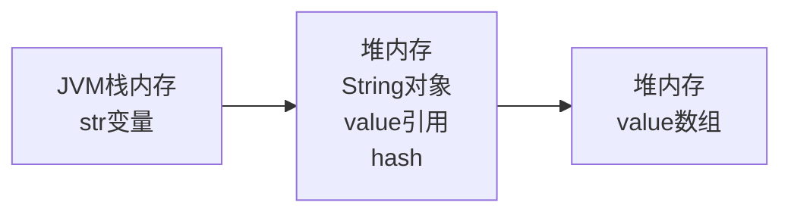

字符串（String）在面试过程中被问到最多的就是“字符串对象为什么是不可变的？”，现在遇到这种题就是送分题了，标准答案网上随便一找有的是。但是，字符串对象真的不可以被改变么？

<!--more-->
> 没错，如果字符串对象真的不可以被改变，那这篇文章也不会出现在这里！

## String不可变的内部细节
Java中所有的字符串对象都是`String`类的一个实例，当我们通过引用直接指向一个字符串字面值（例如：`String s = "chenzhihao"`）或使用`new`操作符创建一个字符串对象（eg：`String s = new String("chenzhihao")`），都会在内存中开辟出一块空间，存储字符串实例。当然，这句话中忽略了好多细节，例如：字符串若出现在常量池中则不再新建对象、`new String("chenzhihao")`会创建两个字符串对象等，因为这不是本篇讨论的细节，这里也先不去纠结这些问题。
> 字符串对象为什么是不可变的？

通过一个示例来演示一下String字符串的“不可变性”：
```java
String s1 = "hello";
s1 = "word";

System.out.println(s1); // print: word
```
> 哎？？你TM不是说字符串不可变吗，个渣男！

先别急，上面的代码执行时，一空创建了两个字符串对象，分别是`hello`和`word`，初始化时引用变量`s1`指向了`hello`对象的堆内存地址，之后，创建新的字符串对象`word`，修改了`s1`变量的指向。实际上改变的是`s1`变量的内存地址值，而字符串对象`hello`依然存在于内存当中，只不过已经没有强引用指向他，随着时间的推移，很可能在某一时刻被GC回收掉，结束了自己的一生。

> 原来如此，既然说字符串是对象，那我可以调用String的方法去修改值吗？

当然不可以！虽然每个字符串对象都是String类型的实例，但是String并没有提供值修改的方法，甚至连获取的方法都没有提供，并且还是用`final`关键字锁住了自己，使得String类不可以被继承。来看一下String的部分源码：
```java
public final class String implements java.io.Serializable, Comparable<String>, CharSequence {
   
    private final char value[];

    private int hash; // Default to 0

    public String() {
        this.value = "".value;
    }

    public int length() {
        return value.length;
    }

    public int hashCode() {
        int h = hash;
        if (h == 0 && value.length > 0) {
            char val[] = value;

            for (int i = 0; i < value.length; i++) {
                h = 31 * h + val[i];
            }
            hash = h;
        }
        return h;
    }

    // ignore some functions
}
```
从String源码中可以看到，他持有一个私有的字符数组`value[]`和一个私有的int类型的`hash`值，分别存放字符串内容以及哈希值。其中字符数组被标记为`final`，即初始化时就需要为其赋值并且该数组的引用不允许被改变。而hash值，在初始化时默认被赋予0值，在首次调用字符串对象的`hashCode()`方法时，会先判断hash值有没有初始化，如果已经初始化过则直接返回，否则计算并为hash属性赋值，从这里可以看出，hash值一经初始化也不会被改变。

## 打破字符串对象的不可变性
通过刚才的分析，我们得出一个结论：
> 字符串对象一经初始化，其内部`字节数组的引用`是不可变的，并且在首次调用hashCode后，会为其hash属性计算一个哈希值，且该值永远不变。

一些小伙伴已经发现了其中的漏洞，我们先通过一个图来描述`String str = "chenzhihao"`这段代码执行后的内存结构：



从String对象的内存结构图来看，String对象中的值（基本类型值、引用类型内存地址值）虽然不可变，但引用类型所指向的实际对象是可变的，这里`value[]`数组是引用类型，只要我们拿到字符串对象中的字符数组的引用，就可以通过引用来操作字符数组，达到改变字符串值的目的。

> But！value数组是私有（private）的，并且没有提供对外的getter/setter方法，如何拿到该引用？

获取对象私有属性最好的方法，就是使用`反射`！反射可以在运行期动态访问对象内部，说干就干！

```java
String str = "chen_zhi_hao";
System.out.println("修改前：" + str);

// 通过反射获取String类的 “value” 属性
Field field = String.class.getDeclaredField("value");

// 该属性为私有的，先将其访问权限修改为可访问（打破private限制）
field.setAccessible(true);

// 获取values属性值，这里引用的类型为字符数组，所以强转不会报错
char[] value = (char[]) field.get(str);

// 修改字符数组，将字符串中的下划线替换为空格
value[4] = ' ';
value[8] = ' ';

System.out.println("修改后：" + str);
```
执行上面的代码，观察变量`str`先后输出的内容：
> 修改前：chen_zhi_hao
> 修改后：chen zhi hao

果然，成功的改变了String对象的内容。上面代码自始至终`str`均指向了`chen_zhi_hao`对象，该对象的内部字符数组保存了字符串的内容，利用反射获取到该对象的内部字符数组，通过修改数组内容达到修改字符串内容的目的。

有些同学可能在上述代码后面又加了一些验证代码，例如在上面代码的最后添加如下代码：
```java
String newStr = "chen zhi hao";
System.out.println(str == newStr); // 输出：false
```

> 你骗银，字符串内容根本没改，你看，都不相等！

莫慌，莫慌~ 此处利用`==`进行判断，比较的是两个对象的内存地址值，`newStr`指向的字符串`chen zhi hao`是一个新的对象，并且声明后会被放在字符串常量池中，与变量`str`相比较，他们俩内容均相同，但是不属于同一个对象。但是，像下面这么玩，就会得到新的结果：
```java
String internStr = str.intern();

System.out.println(str == internStr); // 输出：true

String newStr = "chen zhi hao";
System.out.println(str == newStr); // 输出：true
System.out.println(str == internStr); // 输出：true
```

> 这又是为何？

因为在`String newStr = "chen zhi hao";`创建并声明字符串对象`chen zhi hao`之前，调用了`str.intern()`方法。该方法会先判断该字符串是否在字符串常量池中，如果存在，则返回常量池中的字符串对象，否则将该字符串对象放进常量池中并返回自身。

所以此处，`str`与`internStr`指向的是同一个对象，那么`newStr`为什么也与他俩指向的对象一样呢？因为通过双引号`""`声明的字符串，与`intern`方法类似，都是先从字符串常量池中搜寻，未找到才创建新的并加入到常量池。

## 总结
我们日常开发的系统中，超过80%以上的业务是在对字符串操作，字符串本身不是Java八大基本数据类型之一，他是引用类型，虽然他被标记为`final`，目的之一是为了被泛化，因为Java中规定字符串对象只能通过`java.lang.String`类进行实例化。并且被标记为final的另一个好处在于使得字符串不可变，这里的不可变指的是对象的成员属性值不可变，但是String对象中内嵌了引用对象。
> 一个对象中封装了引用类型成员，那么这个对象就不是不可变的。

引用类型，说白了就是在对象的内存空间内存储了另一个对象的堆内存地址，我们无法改变引用所指向的内存地址，但是我们可以通过拿到该内存地址所指向的实际对象，做自定义修改。而让我们可以访问字符串对象私有属性，`反射`恰恰是最好用的工具。

