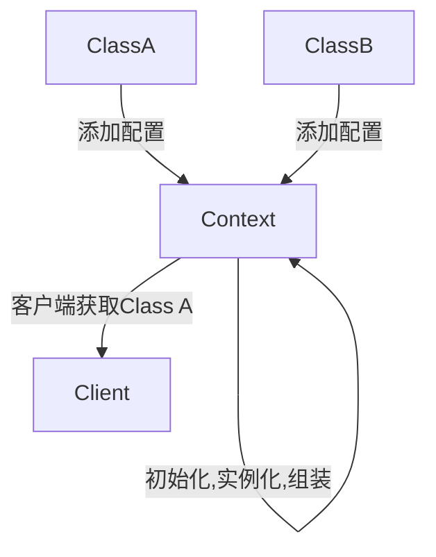

Spring是一套完整的Java企业级开发框架，其内部完整的实现了一套IoC容器体系和面向切面编程（AOP）特性，可以基于SpringIoC特性完成不同框架之间的完美整合，加之轻量级的特点和完善的社区支持，目前仍是使用最多的Java开发框架。

<!--more-->

## IoC是啥？
IoC是控制反转（Inversion of Control）的缩写，也称为依赖注入（DI，即Dependency Injection的缩写），它是面向对象编程领域中的一种设计原则。

## 比划比划
从技术实现角度上来说，客户端需要一个`Class A`的对象，而`Class A`依赖于另一个`Class B`，常规操作需要在客户端使用`new`操作符手动创建`Class A`和`Class B`的对象，完后将`Class B`的对象组装进`Class A`的对象中。示例代码如下：

```java
public class Client{
    B b = new B();
    A a = new A(b);
    // do something~
}

class A {
    private B b;
    public A(B b){
        this.b = b;
    }
}

class B{}
```
客户端手动创建了一大堆对象，一股脑全塞堆内存里了，资源释放谁来做？对于无状态对象还要`new`岂不是很浪费资源？哇，是真的烦！

而使用IoC改写后，则只需提供一个`IoC容器`（Context），将`Class A`需要的外部资源（例如：`Class B`）通过配置文件等方式告诉该容器，则在容器初始化的时候就会将将`Class A`需要的所有外部资源实例化完毕并注入进`Class A`实例中，客户端需要什么就直接从容器中获得即可。流程大致如下：



这样就感觉爽了许多，IoC容器`爸爸`启动时自己去搞定对象实例化和拼装，需要啥管他要啥，从此过上了`衣来伸手饭来张口`的生活，爽歪歪~

## 控制了什么？反转了什么？
从客户端的角度来说，未使用IoC容器之前，对象如何实例化？需要什么样的外部资源？如何组装？这些问题统统都由客户端本身进行控制，换句话说老子一切都干了。但是客户端在这个过程中耦合了太多本身不需要的外部资源，因为对于客户端来说，他只需要ClassA，而ClassA所需的外部资源对客户端来说是未知的，也是客户端无需关心的。而使用了IoC容器之后，客户端只需告诉IoC容器`我需要什么`，IoC容器就会查找出相应的对象提供给客户端。当然，在IoC容器查找对象的过程中可能包含许多很复杂的工作（例如：配置查找、实例化、组装依赖等），这里暂时不一一阐述。（挖个坑~）

客户端将创建实例对象的过程交由IoC容器来做，实例对象所需的外部资源也交由IoC容器负责实例化和注入，而客户端只依赖IoC容器，需要啥就要啥，因此整个过程从根本上来讲是反向的，即IoC容器`控制`了实例对象的创建过程，`反转`了实例对象对于其所依赖资源的获取过程，所以称这个过程为`控制反转`。

